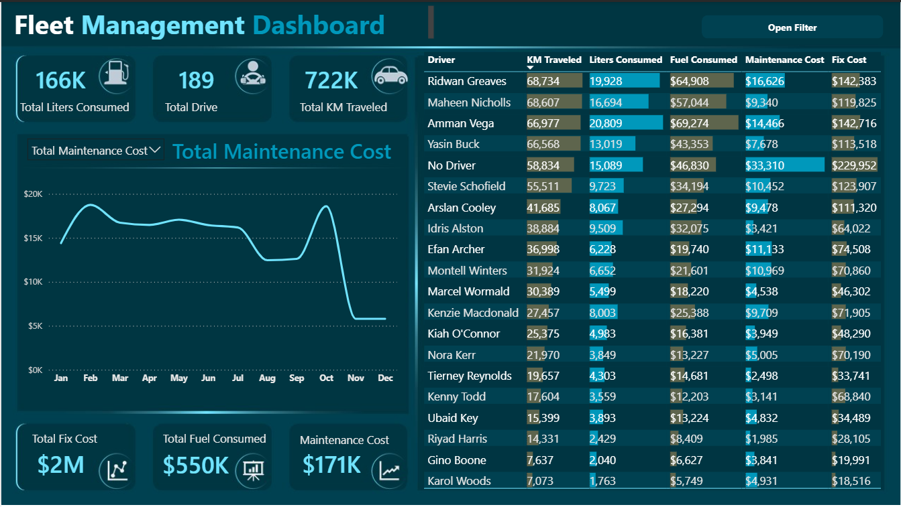
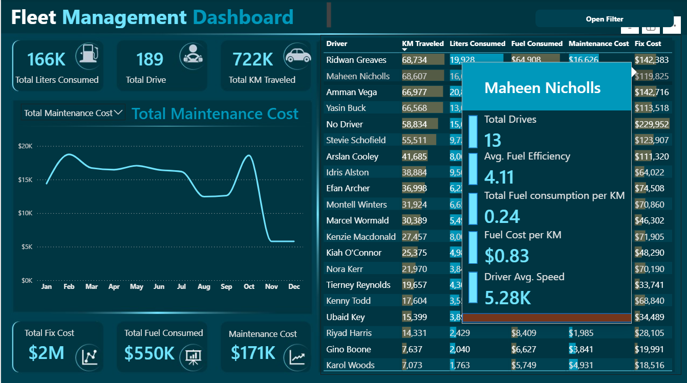
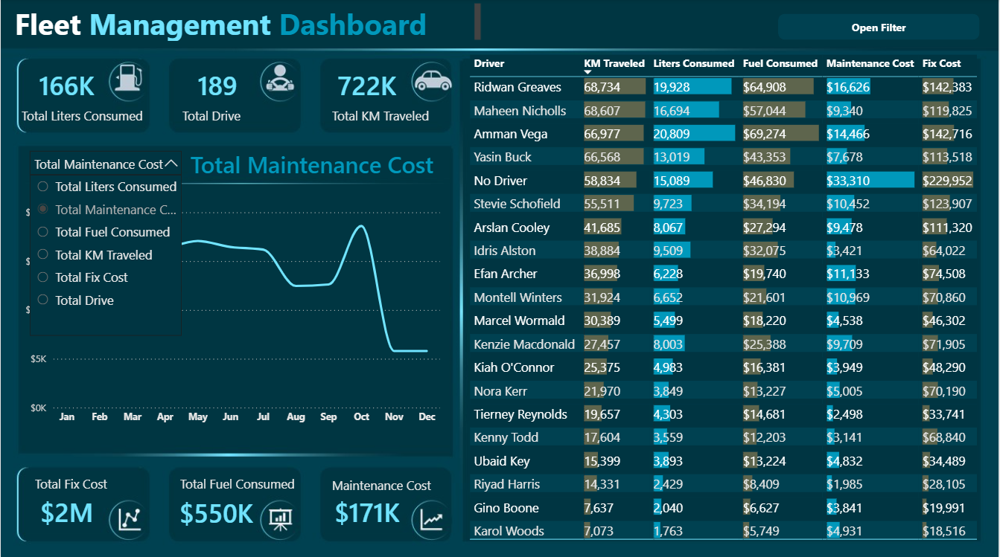
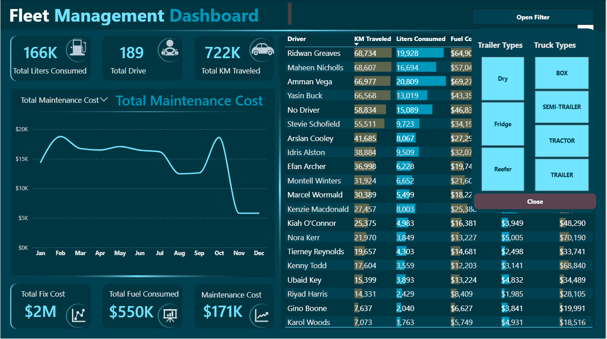

# Fleet Management Dashboard — Power BI Project

## Project Overview

The Fleet Management Dashboard is an interactive Business Intelligence solution developed using Power BI to monitor and analyze fleet operations, fuel usage, maintenance expenses, and driver performance.

The dashboard enables stakeholders to track operational efficiency, identify major cost drivers, monitor vehicle utilization, and support data-driven decision-making within transportation and logistics operations.

This project focuses on transforming raw operational fleet data into actionable business insights through interactive visualizations, KPI monitoring, and dynamic analytical reporting.

---

# Business Problem

Fleet operations generate large volumes of operational and cost-related data, making it difficult for managers to:

- Monitor fuel consumption
- Track maintenance expenses
- Evaluate driver performance
- Analyze operational efficiency
- Identify high-cost operational areas

Without centralized reporting, operational inefficiencies and excessive operational costs can remain unnoticed.

This dashboard was designed to provide a centralized reporting and monitoring system for fleet performance and operational cost analysis.

---

# Objectives

The primary objectives of this project were to:

- Monitor total fuel consumption across the fleet
- Analyze maintenance and operational costs
- Track vehicle utilization using distance traveled
- Evaluate driver-level performance metrics
- Enable interactive filtering and drill-through analysis
- Provide quick KPI summaries for decision-makers
- Support dynamic KPI trend analysis using interactive visualizations

---

# Tools & Technologies Used

- Microsoft Power BI
- Power Query
- DAX (Data Analysis Expressions)
- Microsoft Excel
- CSV Data Sources
- Data Modeling Techniques
- Data Storytelling

---

# Dataset Description

The project utilized multiple datasets containing fleet operational information.

## Fact Tables
- Freight operations data
- Fuel consumption records
- Maintenance cost data

## Dimension Tables
- Driver information
- Vehicle types
- Trailer categories
- Time-related data

## Key Data Fields
- Driver Names
- KM Traveled
- Fuel Consumed
- Fuel Cost
- Maintenance Cost
- Fixed Operational Cost
- Trailer Types
- Truck Categories

---

# Data Cleaning & Transformation

Data preprocessing and transformation were performed using Power Query.

Key transformation steps included:

- Removing duplicate records
- Handling missing values
- Standardizing data formats
- Creating relationships between fact and dimension tables
- Formatting numerical metrics for reporting
- Creating calculated columns and DAX measures
- Optimizing data structure for dashboard performance

---

# Data Modeling

A relational data model was created to connect:

- Fact tables containing operational metrics
- Dimension tables containing descriptive business attributes

The model enabled:

- Efficient filtering
- KPI aggregation
- Drill-through analysis
- Interactive reporting across multiple dashboard components

---

# Key Performance Indicators (KPIs)

The dashboard tracks several critical fleet management KPIs.

| KPI | Description |
|---|---|
| Total Liters Consumed | Measures total fleet fuel usage |
| Total KM Traveled | Tracks overall fleet utilization |
| Fuel Cost | Monitors fuel expenditure |
| Maintenance Cost | Tracks maintenance spending |
| Fixed Cost | Measures operational fixed expenses |
| Fuel Efficiency | Evaluates fuel usage per KM |
| Driver Average Speed | Measures driver operational performance |

---

# Dashboard Features

## Executive KPI Cards

Provides high-level operational summaries including:

- Total liters consumed
- Total drives
- Total KM traveled
- Total maintenance cost
- Total fuel cost

---

## Dynamic KPI Trend Analysis

The dashboard includes a dynamic line chart with an interactive KPI selector that allows users to switch between multiple operational metrics for trend analysis.

Users can dynamically visualize trends for:

- Fuel consumption
- Maintenance costs
- Fuel costs
- KM traveled
- Fixed operational costs
- Total drives

This feature improves dashboard flexibility and enhances analytical storytelling by allowing multiple KPI trends to be analyzed within a single visualization.

---

## Driver Performance Analysis

Interactive driver-level reporting enables users to analyze:

- Distance covered
- Fuel consumption
- Fuel costs
- Maintenance costs
- Fixed operational expenses

The table visualization also highlights comparative driver performance across multiple operational metrics.

---

## Interactive Drill-Through Analysis

Users can drill through individual driver records to access detailed metrics including:

- Fuel efficiency
- Fuel cost per KM
- Total drives
- Average speed
- Fuel consumption per KM

This supports deeper operational analysis and driver-level performance evaluation.

---

## Dynamic Filtering System

The dashboard includes interactive filters for:

- Trailer types
- Truck types
- Operational categories

This enables targeted analysis across different fleet segments and operational conditions.

---

# Key Insights

## Fuel Consumption Monitoring

The fleet consumed approximately **166K liters of fuel**, highlighting fuel expenditure as a major operational cost driver.

---

## Maintenance Cost Trends

Maintenance costs fluctuated throughout the year, with noticeable spikes during specific periods, suggesting increased operational stress or scheduled maintenance cycles.

---

## Operational Cost Analysis

Fixed operational costs exceeded **$2M**, emphasizing the importance of operational efficiency and cost optimization strategies.

---

## Driver Performance Variability

Significant variation existed among drivers in:

- Distance traveled
- Fuel efficiency
- Maintenance-related costs

These insights indicate opportunities for:

- Driver performance optimization
- Improved route planning
- Fuel efficiency training
- Cost reduction initiatives

---

# Business Impact

This dashboard helps fleet managers to:

- Monitor operational performance in real time
- Reduce fuel and maintenance costs
- Improve driver accountability
- Identify operational inefficiencies
- Support strategic planning and decision-making
- Improve overall fleet operational visibility

---

# Skills Demonstrated

This project demonstrates proficiency in:

- Data Visualization
- Dashboard Design
- Power BI Development
- DAX Calculations
- Data Modeling
- Power Query Transformation
- KPI Reporting
- Interactive Reporting
- Business Intelligence
- Analytical Storytelling
- Drill-Through Analytics
- Dynamic Measure Selection

---

# Dashboard Preview

## Main Dashboard Overview

---

## Driver Drill-Through Analysis

---

## Dynamic KPI Trend Selector

---

## Interactive Filter Panel

---

# Conclusion

The Fleet Management Dashboard provides a centralized and interactive reporting solution for analyzing fleet operations, monitoring operational costs, evaluating driver performance, and supporting data-driven decision-making.

The project demonstrates how Power BI can be leveraged to transform operational data into meaningful business intelligence insights through advanced dashboard design, interactive reporting, and analytical visualization techniques.
